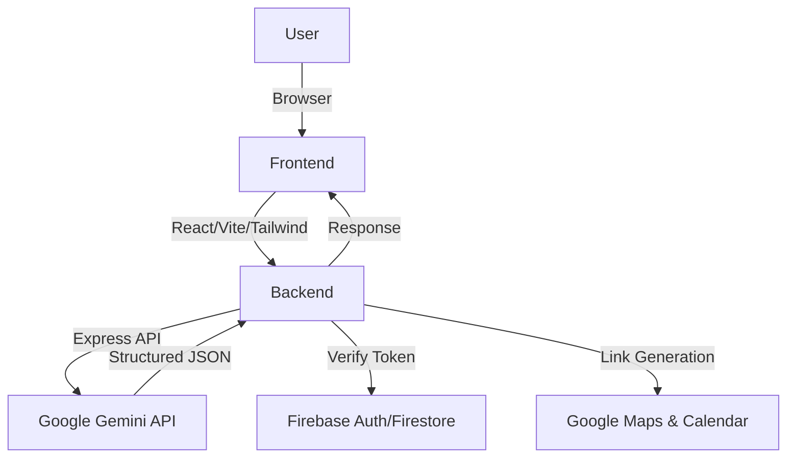

# Smart Election Assistant

## 1. Project Overview
The Smart Election Assistant is an AI-powered web application designed to guide first-time voters and general citizens through the electoral process. By combining conversational AI with practical tools, it simplifies tasks like checking eligibility, finding polling locations, and remembering election dates.

## 2. CHOSEN VERTICAL
**Domain:** Civic Tech (Elections)
**Persona:** First-time voters and general citizens unfamiliar with election systems. The application speaks in simple, encouraging language, avoiding political jargon, and breaking down complex requirements into easy-to-understand steps.

## 3. APPROACH AND LOGIC
The assistant leverages a dynamic intent-classification system powered by the Gemini API. 
**Decision-Making Flow:**
1. **Context Collection:** The user sends a query, which is bundled with recent conversational context.
2. **Intent Detection:** Gemini analyzes the prompt to identify the core intent: `HOW_TO_VOTE`, `ELIGIBILITY`, `ELECTION_DATE`, `POLLING_LOCATION`, or `GENERAL_INFO`.
3. **Routing & Execution:**
   - For `ELIGIBILITY`, the assistant ensures it has minimum data (age, citizenship status) before responding.
   - For `POLLING_LOCATION`, it generates quick actions to open Google Maps based on a provided zip code.
   - For `ELECTION_DATE`, it provides Google Calendar links for reminders.
4. **Structured Response:** Every AI output follows a strict structure: Summary, Explanation, Step-by-Step, Quick Action, and Follow-up Question.

## 4. HOW THE SOLUTION WORKS
**End-to-End System Flow:**
1. **User** interacts with the sleek, beginner-friendly React/Vite UI.
2. **Frontend** captures input and securely sends it along with authentication context to the Backend.
3. **Backend (Node.js/Express)** receives the request, verifies the Firebase Auth token, and orchestrates the logic.
4. **AI (Gemini API)** processes the conversation and returns a structured JSON object.
5. **Services** (Google Maps Links, Google Calendar Links) are bundled into the response.
6. **Frontend** renders the AI's response, presenting actionable buttons and clear steps.

## 5. ASSUMPTIONS MADE
- Users have basic internet access and a web browser.
- Public election data (like dates and general rules) is consistent, but users must verify specific local regulations.
- The user will provide a ZIP code or general address when asking for polling locations (we do not use auto-geolocation to respect privacy).
- The user is asking in good faith (non-political queries).

## 6. Architecture Diagram


## 7. Google Services Usage
- **Gemini API:** Core reasoning, intent detection, and response structuring.
- **Firebase:** User authentication (Google OAuth) and data storage (Firestore for chat history).
- **Google Maps:** Used via constructed URLs to direct users to polling locations or local election offices.
- **Google Calendar:** Used via event template URLs to allow users to easily add election dates to their calendars.

## 8. Setup Instructions

### Prerequisites
- Node.js (v18+)
- Firebase Account (Create a project, enable Authentication with Google, and Firestore)
- Google Cloud Console (Get API keys for Gemini)

### Environment Variables
1. Copy `.env.example` to `.env` in the root (or in both frontend/backend directories depending on your setup preference).
2. Fill in the required keys.

### Running Locally
You can run both frontend and backend concurrently from the root directory if configured, or run them separately:

**Backend:**
```bash
cd backend
npm install
node src/server.js
```

**Frontend:**
```bash
cd frontend
npm install
npm run dev
```

## 9. Branch Strategy
This repository adheres to a **Strict Single-Branch (main-only) Rule**. All code is developed locally, tested, and pushed directly to `main` to maintain stability.
